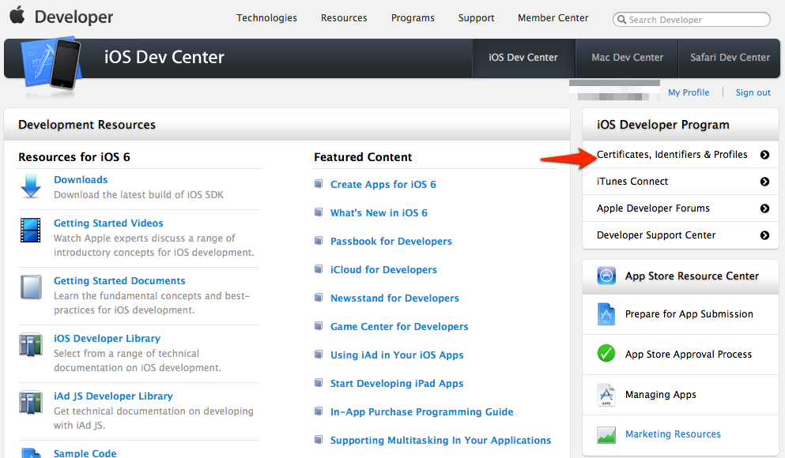
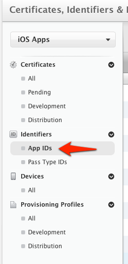
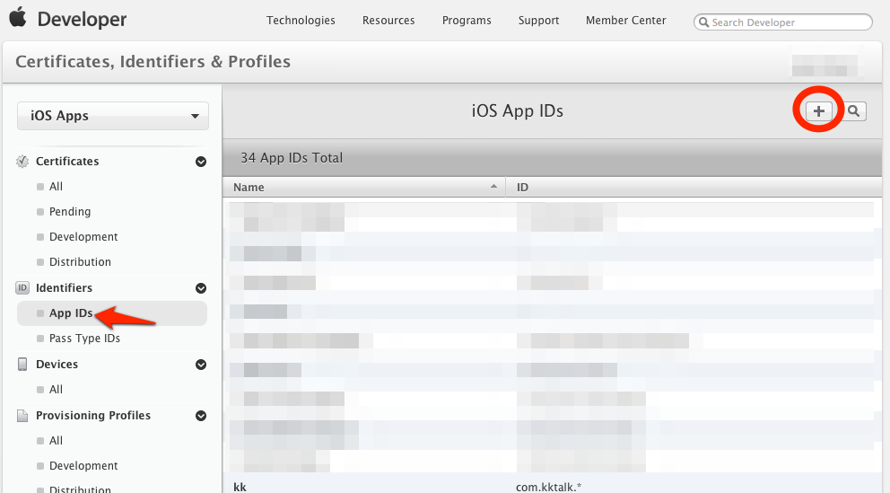
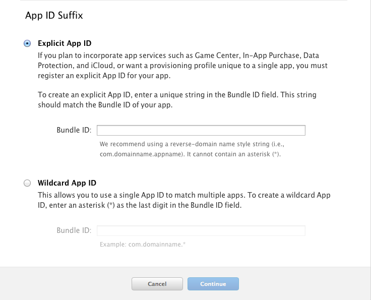
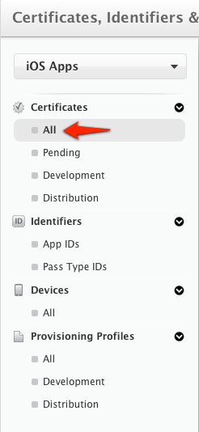
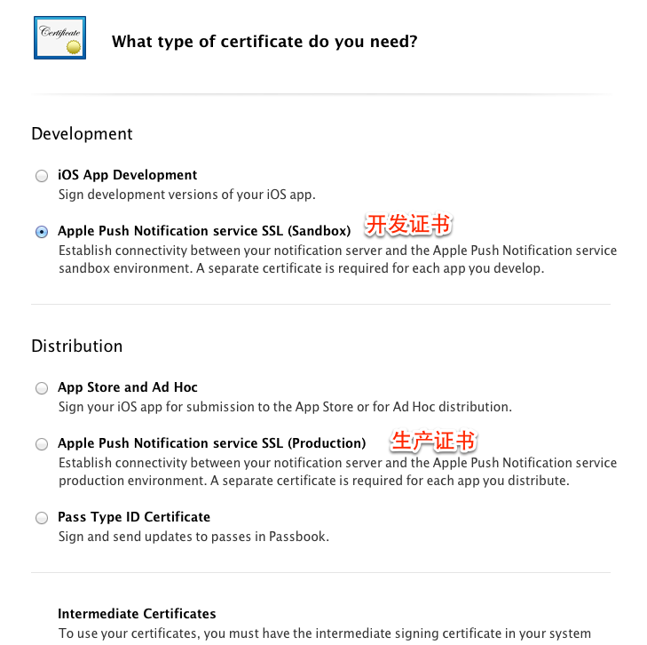
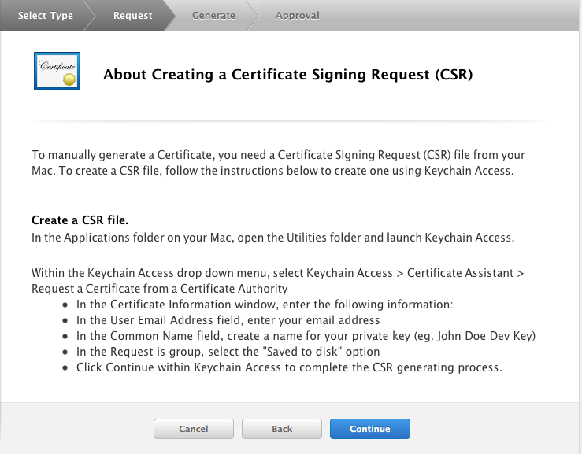

# iOS 证书设置指南 #

## 创建应用程序ID ##

登陆 [iOS Dev Center](https://developer.apple.com/devcenter/ios/index.action) 选择进入*iOS Provisioning Portal*。

在 [iOS Provisioning Portal](https://developer.apple.com/ios/manage/overview/index.action)中，点击App IDs进入App ID列表。

创建 App ID，如果 ID 已经存在可以直接跳过此步骤

为 App 开启 Push Notification 功能。如果是已经创建的 App ID 也可以通过设置开启 Push Notification 功能。

根据实际情况完善 App ID 信息并提交,注意此处需要指定具体的 Bundle ID 不要使用通配符。

## 配置和下载证书 ##

如果你之前没有创建过 Push 证书或者是要重新创建一个新的，请在证书列表下面新建。

新建证书需要注意选择证书种类（开发证书用于开发和调试使用，生产证书用于 App Store 发布）

点击 Continue 后选择证书对应的应用ID，然后继续会出现“About Creating a Certificate Signing Request (CSR)”。

根据它的说明创建 Certificate Signing Request。

选择菜单“钥匙串访问 -> 证书助理-> 从证书颁发机构求证书”.
注意，如果此时密钥中的某个私钥处于选中状态，则菜单会变为“钥匙串访问->证书助理->用<私钥>从证书颁发机构求证书”，这样制作出来的CSR是无效的。

输入你的email地址和名字。确保email地址和名字与你注册为iOS开发者时登记的相一致。
勾选Saved to Disk（保存到磁盘）及Let me specify key pair information（指定密钥对信息），然后点Continue。

然后点击 Continue ，上传刚刚生成的 .certSigningRequest 文件 生成 APNs Push  Certificate。

下载并双击打开证书，证书打开时会启动“钥匙串访问”工具。

在“钥匙串访问”中你的证书会显示在“我的证书”中，注意选择**我的证书**（“My Certificates”） 和**登录**（"login"）

## 导出 .p12 证书文件 ##

在“钥匙串访问”中，选择刚刚加进来的证书，选择右键菜单中的“导出“...””。

>注意要选“login”和“My Certificates” 导出证书时要选中证书文件，不要展开private key。

将文件保存为Personal Information Exchange (.p12)格式。

## pem证书生成 ##

用p12证书文件转换成pem证书文件。在终端里运行以下命令转换：

    openssl pkcs12 -in MyApnsCert.p12 -out MyApnsCert.pem -nodes
提示输入密码，就是p12的导出密码。

## 上传证书 ##

针对某应用程序，上传上面步骤得到.pem证书文件。这是 iOS SDK 能够接收到Push推送消息的必要步骤。

## 生成新Provisioning Profiles文件 ##

> 需要注意：证书中使用的Bundle ID 要与 Xcode项目的Bundle ID 一致